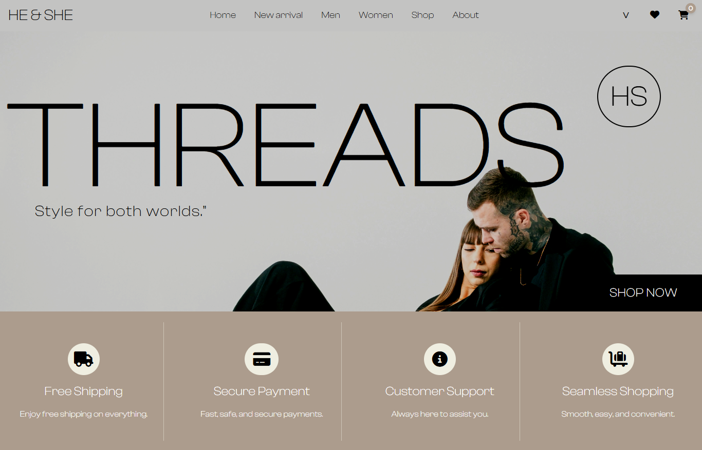
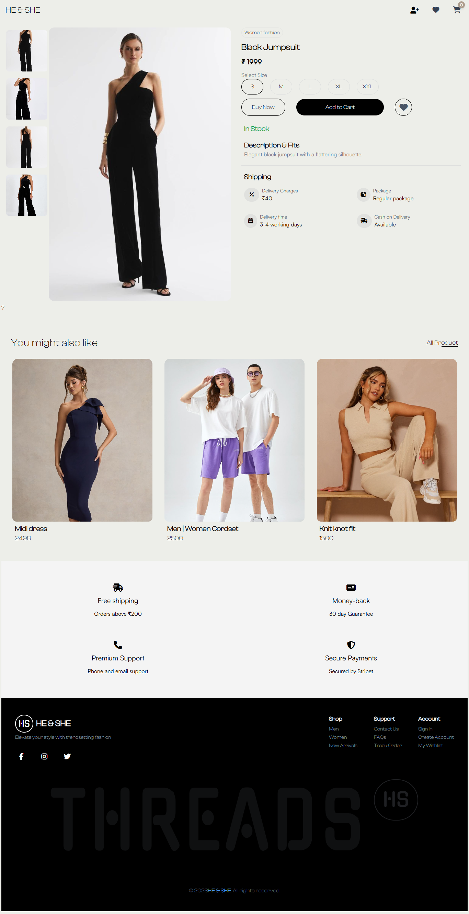
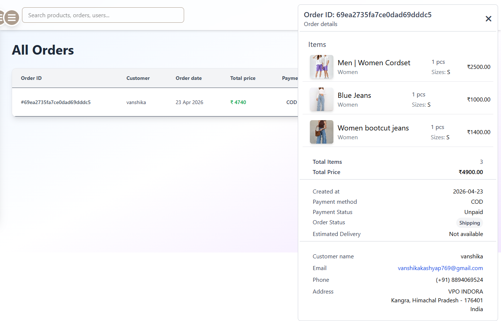
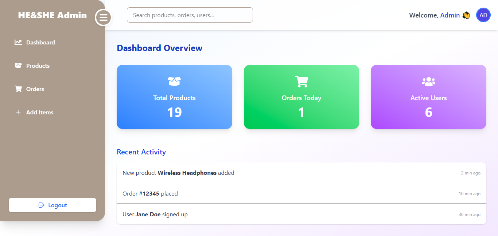

# 🛒 HE & SHE 

### A Complete E-Commerce Platform with User & Admin Management

He & She is a full-stack e-commerce application designed to deliver a seamless online shopping experience for users along with a powerful admin panel for managing the entire system.  
It allows customers to buy products, manage their cart, and place orders, while administrators can handle products, users, and orders efficiently.  
The platform focuses on usability, performance, and real-world scalability.

---

## ✨ Features

### 👤 User Features
- 🛍️ explore products  
- 🛒 Add to cart and manage cart  
- 💳 Secure checkout process  
- 📦 View and track orders  

### 🛠️ Admin Features
- 📦 Manage products (add, update, delete)  
- 👥 Manage users  
- 🧾 View and manage all orders  
- 📊 Dashboard for system overview  

### 🔐 General Features
- 🔑 Secure authentication system  
- 📱 Responsive and clean UI  
- ⚡ Smooth user experience  

---

## 🛠️ Tech Stack

- **Frontend:** React.js  
- **Backend:** Node.js, Express.js  
- **Database:** MongoDB  
- **Authentication:** JWT  

---

## 📌 How It Works

- Users sign in and browse products  
- Add items to the cart and place orders  
- Orders are stored and managed in the system  
- Admin logs in to the dashboard  
- Admin manages products, users, and orders  

---

## 💡 Key Highlights

- Complete e-commerce system (User + Admin panel)  
- Centralized order and product management  
- Secure and scalable full-stack architecture  
- Clean and intuitive user interface  

---

## 🌐 Live Demo

👉 [View He & She Live](https://your-live-link.com)

---

## 📸 Screenshots

### 🏠 Home Page

### 🛒 Product

### 📦 Orders

### 🛠️ Admin Dashboard

---

## 👩‍💻 Developed By Vanshika 

